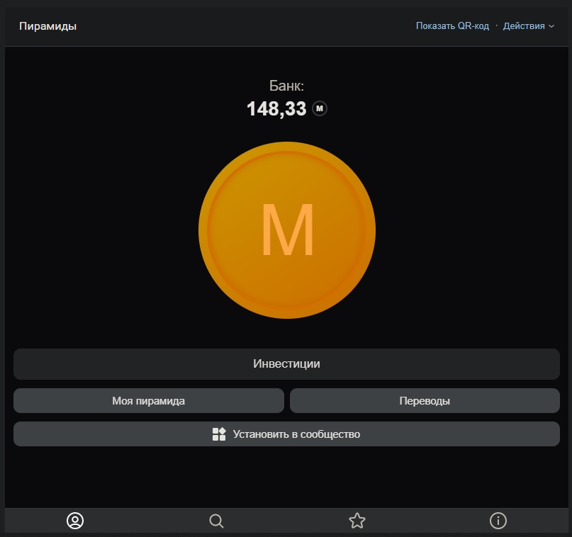
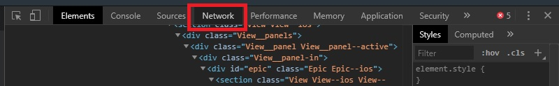
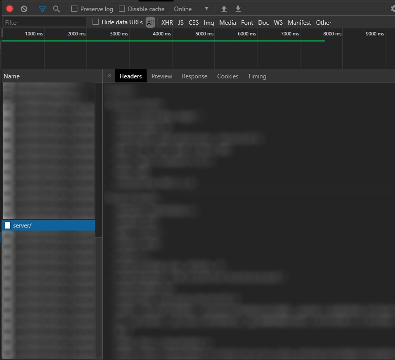
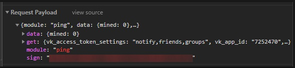
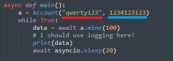

# Злом [пирамид](https://vk.com/app7252470)

Перед тем как зламывать ж- пирамиду убедитесь что в скрипте указан sign и user_id

```python
async def main():
    # в первую очередь идет sign, вторым идет ваш вк айди
    a = Account("...", ...)
    #...
```


```bash
git clone https://github.com/ITTalks/mmm_coin_bot
cd mmm_coin_bot
python player.py
```


## Да кто такой это ваш sign? Как мне его достать?

Для начала нужно открыть само приложение



После чего быстренько открываем инструменты для разработчиков (ака Код элемента), переходим во вкладку Network



Там видим различные запросы которые в основном нам ну никак не пригодятся, ищем что-то похожее на "server/"  слева



Если "server/" нигде не видно то можно попробовать помайнить немного и подождать несколько секунд

Тыкаем на "server/", проверяем что сверху открыта вкладочка Headers (если нет то откройте господя ради)

Иии скроллим вниз и видим такую картину



Тут можно увидеть sign, копируем все что располагается внутри кавычек и вставляем в код (на картинке красным указано куда вставлять sign, синим куда вставлять свой ойди)

