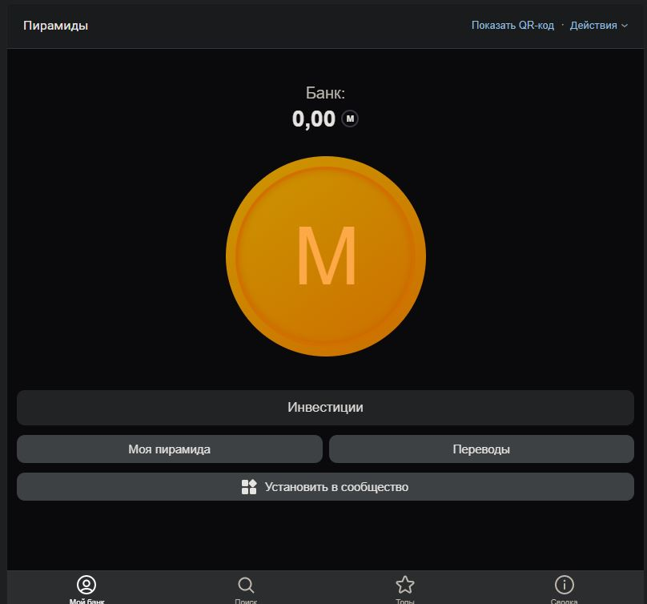
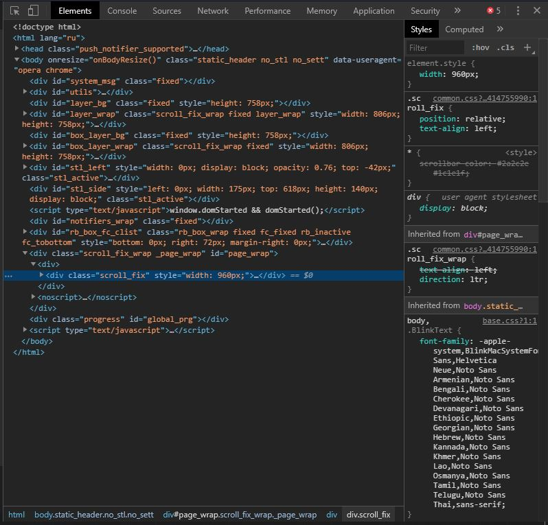
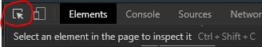
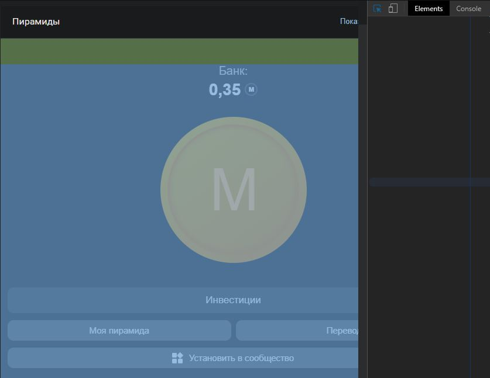
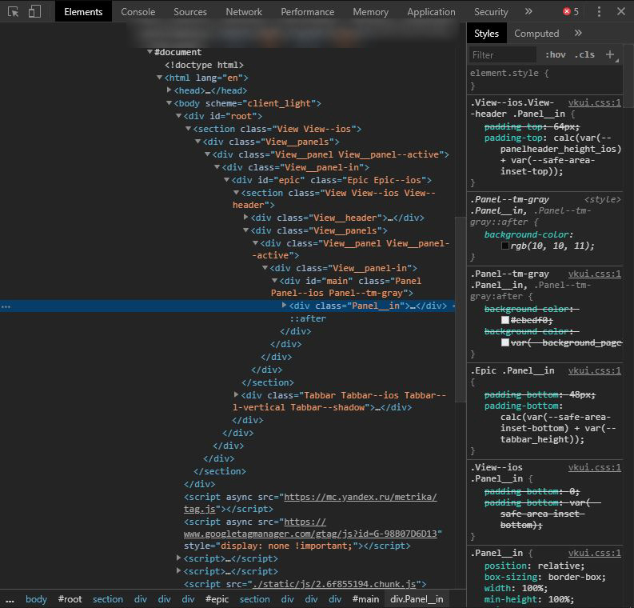
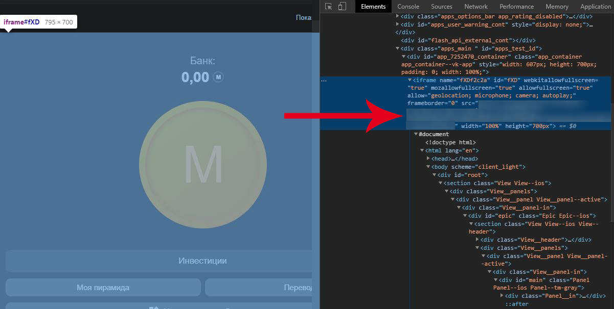
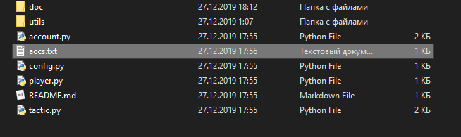
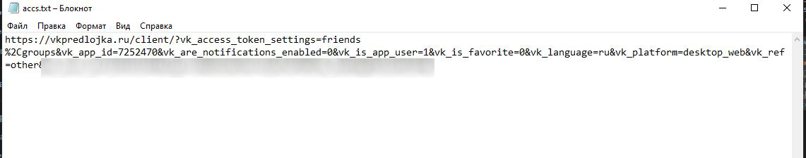

# Злом [пирамид](https://vk.com/app7252470)

## Зопускаем

берем кидаем ссылки (о получении неё чуть ниже) в accs.txt или в файл который указан в конфиге (config.py)

```bash
git clone https://github.com/ITTalks/mmm_coin_bot
cd mmm_coin_bot
pip install aiohttp
python player.py
```


## Получение ссылки

Заходим в приложение



Открываем инструменты разработчиков (ака Код элемента)



Жмем на кнопку для выбора элемента



И выбираем то что у нас на приложении, оно должно всё выделиться синеньким как-то так:



Затем видим такую картину справа



Как видно на картинке сверху у нас есть какая-то странная ~~почему-то замазанная~~ ссылка, проскроллим вверх и скопируем содержимое **src** располагающегося **в iframe** причем без кавычек



Создаем в папке куда скачали скрипт файл accs.txt



Вставляем ссылку (если у вас есть доп аккаунты то можно кинуть и несколько ссылок, разделяя их ентером)



Сохраняем

Зопускаем